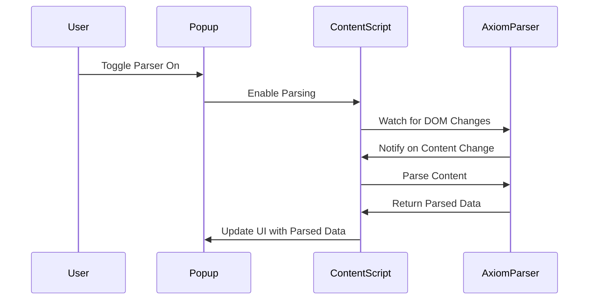

# Axiom Parser Chrome Extension

A Chrome extension that parses and formats content from Axiom (app.axiom.co) with a toggle-enabled interface.

## Features

- **Domain-specific**: Only runs on `app.axiom.co`
- **Toggle Control**: Enable/disable parsing via popup interface
- **Content Parsing**: Extracts URLs and JSON messages from Axiom's interface
- **Content Formatting**: Formats and displays parsed content with pretty-printed JSON
- **Auto-parsing**: Automatically detects content changes when enabled
- **Manual Parsing**: Parse content on-demand with a button click

## Architecture

### Components

1. **AxiomParser Class** (`utils/parser.ts`)
   - Extracts content from Axiom's DOM structure
   - Parses URLs and JSON messages using regex
   - Formats and stores content in the DOM
   - Uses `pretty-print-json` for JSON formatting

2. **Content Script** (`src/content.ts`)
   - Monitors DOM changes when parser is enabled
   - Handles messages from popup
   - Integrates with AxiomParser class

3. **Popup Interface** (`src/App.tsx`)
   - Toggle switch to enable/disable parser
   - Manual parse button
   - Status feedback
   - Modern, clean UI

4. **Background Script** (`src/background.ts`)
   - Handles extension lifecycle events
   - Message passing coordination

## Development

### Setup

```bash
npm install
```

### Development Mode

```bash
npm run dev
```

### Build for Production

```bash
npm run build
```

### Testing

```bash
npm test
npm run test:ui  # Interactive test UI
```

### Load Extension in Chrome

1. Build the extension: `npm run build`
2. Open Chrome and go to `chrome://extensions/`
3. Enable "Developer mode"
4. Click "Load unpacked" and select the `build` folder

## Usage

1. Navigate to `app.axiom.co`
2. Click the extension icon to open the popup
3. Toggle the parser on/off
4. Use "Parse Now" for manual parsing
5. The extension will automatically parse content when changes are detected

## Technical Details

- **Manifest V3** Chrome extension
- **React 18** with TypeScript
- **Vite** for building and development
- **ESLint** for code quality
- **CSS** with modern styling and toggle switches

## Permissions

- `scripting`: For content script injection
- `activeTab`: For accessing current tab
- `storage`: For persisting settings
- `host_permissions`: Limited to `https://app.axiom.co/*`

## Project Structure

- `public/`: Contains static files and the `manifest.json`
- `src/`: Contains the React popup app source code
- `utils/`: Contains the AxiomParser class
- `build/`: Generated build files for the extension
- `vite.config.ts`: Vite configuration file
- `vitest.config.ts`: Vitest testing configuration
- `tsconfig.json`: TypeScript configuration files

## License

This project is licensed under the MIT License.

## How It Works

The Axiom Parser Chrome Extension operates by monitoring changes in the DOM of the Axiom application and automatically parsing content when changes are detected. Here's a step-by-step explanation of the process:

1. **User Interaction**: The user enables the parser through the popup interface by toggling the switch.
2. **Activation**: The content script is activated, which in turn enables the AxiomParser to start monitoring the DOM for changes.
3. **Monitoring**: The AxiomParser continuously watches for any changes in the DOM structure of the Axiom application.
4. **Detection**: Upon detecting a change, the AxiomParser automatically parses the new content, extracting URLs and JSON messages.
5. **Parsing**: The parsed content is formatted and stored, ready to be displayed in the popup interface.
6. **Feedback**: The popup interface is updated with the parsed data, providing the user with immediate feedback.

Below is a sequence diagram illustrating this process:

